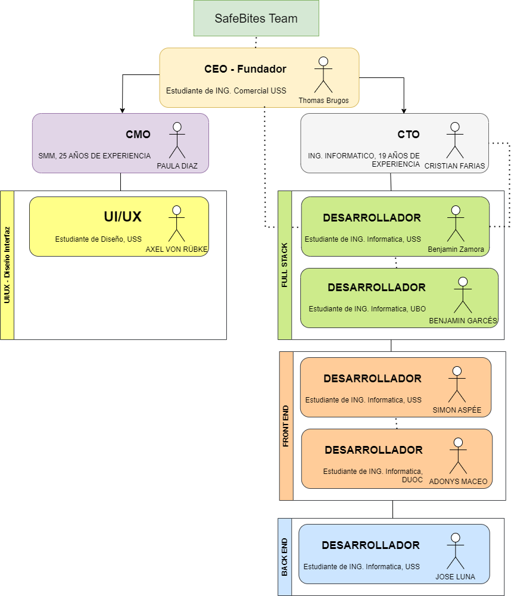
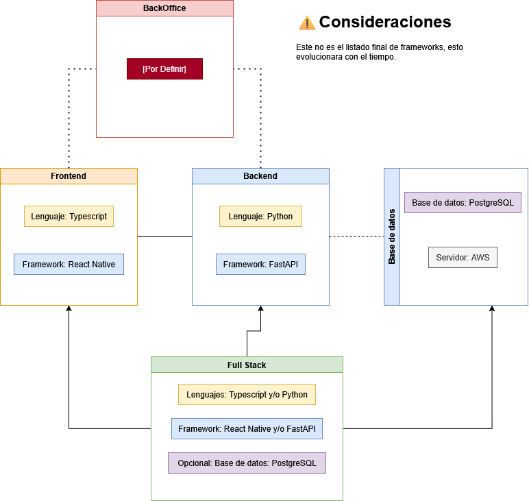

# 🛒 HealthBytes - Ecommerce Inteligente y Seguro

[](https://www.typescriptlang.org/)
[](https://reactnative.dev/)
[](https://fastapi.tiangolo.com/)
[](https://aws.amazon.com/)

> **La forma más inteligente y segura de comprar comestibles** 🚀

HealthBytes es una plataforma de e-commerce especializada en personas con necesidades alimenticias específicas como diabetes, celiaquía y otras restricciones dietéticas. Nuestra misión es hacer que las compras de alimentos sean seguras, fáciles y accesibles para todos.

## 📋 Tabla de Contenidos

- [🎯 Objetivo del MVP](#-objetivo-del-mvp)
- [✨ Características](#-características)
- [🏗️ Arquitectura](#️-arquitectura)
- [📂 Estructura del Proyecto](#-estructura-del-proyecto)
- [⚙️ Tecnologías](#️-tecnologías)
- [🚀 Instalación](#-instalación)
- [📊 Diagramas](#-diagramas)
- [🤝 Contribución](#-contribución)
- [📄 Licencia](#-licencia)

## 🎯 Objetivo del MVP

Desarrollar un **ecommerce funcional** con las siguientes funcionalidades prioritarias:

### 🔥 Prioridad Alta
- **🏠 Página Principal** - Interfaz intuitiva y accesible
- **🔍 Búsqueda de Productos** - Sistema de búsqueda avanzado con filtros de alérgenos
- **🛒 Carrito de Compras** - Gestión completa del carrito con validaciones
- **🎛️ BackOffice** - Panel administrativo para gestión de productos
- **💳 Portal de Pagos** - Integración segura de pagos

### 🟡 Prioridad Media
- **🎚️ Filtros de Productos** - Filtrado por restricciones dietéticas y alérgenos

### 🔵 Prioridad Baja
- **📅 Reservas de Productos** - Sistema de reservas y pedidos programados

### 🟣 A Considerar
- **🔗 Integración con Proveedores** - Conexión directa con proveedores
- **🎛️ Funcionalidad Pixel** - Gestión de paquetes de terceros y analytics

## ✨ Características

- 🩺 **Enfoque en Salud**: Diseñado específicamente para personas con restricciones alimentarias
- 📱 **Mobile First**: Optimizado para dispositivos móviles
- 🔒 **Seguro**: Validación rigurosa de ingredientes y alérgenos
- ⚡ **Rápido**: Arquitectura optimizada para rendimiento
- 🌐 **Escalable**: Arquitectura preparada para crecimiento

## 🏗️ Arquitectura

El proyecto utiliza una **arquitectura monolítica** optimizada para el MVP, con capacidad de evolución hacia microservicios:

- **Frontend**: React Native (Mobile First)
- **Backend**: FastAPI (Python)
- **Base de Datos**: PostgreSQL
- **Infraestructura**: Amazon Web Services (AWS)

## 📂 Estructura del Proyecto

```
HealthBytes_app/
├── 📁 Docs/                    # Documentación del proyecto
│   └── 📁 Diagramas/          # Diagramas de arquitectura
├── 📁 shop/                   # Aplicación React Native
│   ├── 📁 src/
│   ├── 📁 assets/
│   └── package.json
├── 📁 backend/                # API FastAPI (si existe)
├── 📄 README.md
└── 📄 .gitignore
```

## ⚙️ Tecnologías

### Frontend
- **React Native** - Framework móvil multiplataforma
- **TypeScript** - Tipado estático para JavaScript
- **React Navigation** - Navegación entre pantallas

### Backend
- **Python** - Lenguaje de programación
- **FastAPI** - Framework web moderno y rápido
- **SQLAlchemy** - ORM para base de datos

### Base de Datos
- **PostgreSQL** - Base de datos relacional

### Infraestructura
- **AWS** - Servicios de nube
- **Docker** - Containerización (recomendado)

### Herramientas de Desarrollo
- **VS Code / Cursor** - Editor de código recomendado
- **JetBrains** - IDEs alternativos
- **Git** - Control de versiones

## 🚀 Instalación

### Prerrequisitos

- Node.js (v16 o superior)
- Python (v3.8 o superior)
- Git
- Android Studio / Xcode (para desarrollo móvil)

### 1. Clonar el Repositorio

```bash
git clone https://github.com/WindB3NJA/Safebites_app.git
cd HealthBytes_app
```

### 2. Configurar el Frontend (React Native)

```bash
cd shop
npm install
# o
yarn install
```

### 3. Configurar el Backend (FastAPI)

```bash
cd backend  # Si existe la carpeta
pip install -r requirements.txt
```

### 4. Variables de Entorno

Crear archivo `.env` en la raíz del proyecto:

```env
# Database
***REDACTED_DATABASE_URL***

# API Keys
STRIPE_SECRET_KEY=your_stripe_key
AWS_ACCESS_KEY_ID=your_aws_key
```

### 5. Ejecutar la Aplicación

#### Frontend (React Native)
```bash
cd shop
npx react-native run-android  # Android
# o
npx react-native run-ios      # iOS
```

#### Backend (FastAPI)
```bash
cd backend
uvicorn main:app --reload --host 0.0.0.0 --port 8000
```

## 📊 Diagramas

### 🥷 Infraestructura Personal


### ⚙️ Infraestructura Frameworks


## 🧪 Testing

```bash
# Frontend
cd shop
npm test

# Backend
cd backend
pytest
```

## 📱 Capturas de Pantalla

_Próximamente - Capturas de la aplicación móvil_

## 🤝 Contribución

1. Fork el proyecto
2. Crea una rama para tu feature (`git checkout -b feature/AmazingFeature`)
3. Commit tus cambios (`git commit -m 'Add some AmazingFeature'`)
4. Push a la rama (`git push origin feature/AmazingFeature`)
5. Abre un Pull Request

## 📈 Roadmap

- [ ] MVP Q2 2025
- [ ] Integración con proveedores
- [ ] Expansión a web
- [ ] Sistema de recomendaciones IA
- [ ] Marketplace de productos especializados

## 👥 Equipo

- **Developer**: [@WindB3NJA](https://github.com/WindB3NJA)

## 📄 Licencia

Este proyecto está bajo la Licencia MIT. Ver el archivo `LICENSE` para más detalles.

## 📞 Contacto

¿Tienes preguntas o sugerencias? 

- 📧 Email: [tu-email@ejemplo.com]
- 🐙 GitHub: [@WindB3NJA](https://github.com/WindB3NJA)

---

<div align="center">

**HealthBytes** - Haciendo las compras de alimentos más seguras para todos 🛒❤️

[](https://github.com/WindB3NJA/HealthBytes_app)

</div>
