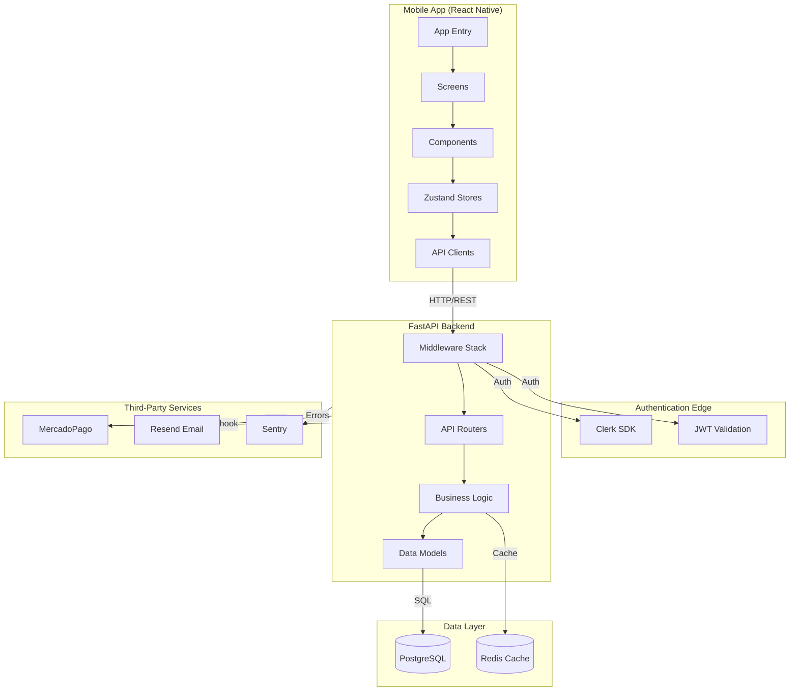

<!-- generated-by: gsd-doc-writer -->
# Architecture

HealthBytes is a mobile-first e-commerce platform for users with dietary restrictions. The system follows a modular monolith architecture with clear separation between frontend (React Native) and backend (FastAPI).

## System Overview

HealthBytes provides a curated catalog of health products with smart filtering for allergens and dietary needs. The platform consists of a React Native mobile app communicating with a FastAPI backend via REST API, persisting data in PostgreSQL with Redis caching for performance optimization.

The architecture is designed around:
- **Mobile-first client**: React Native with Expo for cross-platform deployment
- **API layer**: FastAPI with async SQLAlchemy 2.x for high performance
- **Data persistence**: PostgreSQL with full-text search and Redis caching
- **Authentication**: Dual system (Clerk + JWT) for flexibility
- **Payments**: MercadoPago integration with webhook handling

## Component Diagram



## Data Flow

### Typical API Request Flow

1. **Client Request**: Mobile app sends HTTP request with Authorization header
2. **Middleware Stack**: 
   - CORS validation
   - Rate limiting (SlowAPI with Redis storage)
   - Body size validation
   - Security headers injection
   - User authentication (Clerk/JWT)
3. **Router**: FastAPI router delegates to appropriate endpoint
4. **Service Layer**: Business logic execution (e.g., `product_service.py`, `cart_service.py`)
5. **Data Access**: SQLAlchemy ORM queries PostgreSQL
6. **Response**: Pydantic schemas serialize and validate response
7. **Client Update**: App updates Zustand store and re-renders UI

### Key Request Flows

#### Product Search
```
User Input → search.tsx → GET /products?search=... 
→ product_service.search_products() → PostgreSQL FTS
→ ProductResponse → Zustand store → UI Update
```

#### Checkout Process
```
Cart Review → POST /orders → reserve_stock_batch()
→ Create MercadoPago preference → Return payment URL
→ User completes payment → MP webhook → update_order_status()
→ Send confirmation email → Order confirmed
```

## Key Abstractions

### Backend Layer (FastAPI)

| Component | File | Purpose |
|-----------|------|---------|
| **Main App** | `app/main.py` | FastAPI app initialization, middleware setup |
| **Config** | `app/config.py` | Settings management from environment |
| **Routers** | `app/api/v1/*.py` | HTTP endpoint handlers (products, orders, cart, etc.) |
| **Services** | `app/services/*.py` | Business logic layer (13 service modules) |
| **Models** | `app/db/models/*.py` | SQLAlchemy ORM definitions |
| **Schemas** | `app/db/schemas.py`, `app/schemas/*.py` | Pydantic request/response DTOs |
| **Middleware** | `app/middleware/*.py` | Auth, CORS, rate limiting |
| **Limiter** | `app/core/limiter.py` | SlowAPI rate limiter configuration |
| **Security** | `app/core/security.py` | JWT encoding/decoding utilities |

### Frontend Layer (React Native)

| Component | Location | Purpose |
|-----------|----------|---------|
| **Screens** | `app/*.tsx` | Page-level components (cart, checkout, orders) |
| **Components** | `components/` | Reusable UI components |
| **Stores** | `store/` | Zustand state management |
| **API Clients** | `api/` | HTTP request functions |
| **Hooks** | `hooks/` | Custom React hooks |
| **Types** | `types/` | TypeScript type definitions |

### Database Models

| Model | Purpose |
|-------|---------|
| **User** | Customer accounts with Clerk/JWT auth |
| **Product** | Product catalog with dietary tags |
| **Order** | Customer orders with status tracking |
| **CartItem** | Shopping cart items |
| **Address** | Delivery addresses |
| **Favorite** | Wishlist items |
| **DietaryTag** | Allergen/diet classifications |
| **PaymentPreference** | MercadoPago payment tracking |

## Directory Structure Rationale

```
HealthBytes-dev/
├── backend/                    # FastAPI REST API
│   ├── app/
│   │   ├── api/v1/          # HTTP routers (thin, delegate to services)
│   │   ├── services/        # Business logic (all complex operations)
│   │   ├── schemas/         # Pydantic DTOs for validation
│   │   ├── db/models/       # SQLAlchemy ORM models
│   │   ├── core/            # Security, exceptions, limiter
│   │   ├── middleware/      # Auth, CORS middleware
│   │   └── main.py          # App factory and middleware setup
│   ├── tests/               # pytest tests (450+ tests)
│   ├── migrations/           # Alembic database migrations
│   └── Dockerfile           # Multi-stage Docker build
│
├── frontend/                 # React Native mobile app
│   ├── app/                 # Expo Router screens (file-based routing)
│   ├── components/          # Reusable UI components
│   ├── store/               # Zustand state stores
│   ├── api/                 # HTTP client functions
│   ├── hooks/               # Custom React hooks
│   ├── types/               # TypeScript type definitions
│   └── __tests__/           # Jest/RNTL tests (130 tests)
│
├── docs/                    # Project documentation
├── infra/                   # AWS infrastructure scripts
└── docker-compose.yml       # Local development setup
```

### Backend Structure

- **`api/v1/`**: Thin HTTP handlers that delegate to services. No business logic here.
- **`services/`**: All business logic lives here. 13 service modules handle specific domains.
- **`db/models/`**: SQLAlchemy models with relationships and indexes.
- **`core/`**: Cross-cutting concerns (security, rate limiting, exceptions).

### Frontend Structure

- **`app/`**: Expo Router uses file-based routing. Each `.tsx` is a route.
- **`store/`**: Zustand stores for cart, user, and preferences state.
- **`components/`**: Presentational components with Gluestack UI.

## API Versioning

All endpoints are versioned under `/api/v1/` prefix:

```
/api/v1/products     - Product catalog
/api/v1/orders      - Order management
/api/v1/cart        - Shopping cart
/api/v1/users       - User profile
/api/v1/favorites   - Wishlist
/api/v1/addresses   - Delivery addresses
/api/v1/payments/mercadopago  - Payment processing
```

## Security Architecture

### Authentication Flow

1. Clerk SDK handles user authentication in the mobile app
2. Clerk provides JWT tokens (or falls back to custom JWT)
3. Backend validates tokens via:
   - Clerk JWKS endpoint (primary)
   - Local JWT secret (fallback)
4. User ID extracted and attached to `request.state.user`

### Middleware Stack (in order)

1. **Rate Limiting** (SlowAPI) - Redis-backed distributed limiting
2. **CORS** - Allowlist of origins for dev, restrict in prod
3. **Security Headers** - X-Frame-Options, HSTS, etc.
4. **Body Size Limit** - Prevent memory exhaustion attacks
5. **User Attachment** - Extract user from token for downstream handlers

## Caching Strategy

Redis is used for:
- **Product caching**: `get_products_cached()` with 5-minute TTL
- **Rate limit counters**: Distributed across multiple API instances

## Monitoring & Observability

- **Sentry**: Error tracking and performance monitoring
- **Structured Logging**: JSON logs in production, plain text in dev
- **Health Endpoints**: `/health` and `/health/jwks` for monitoring
