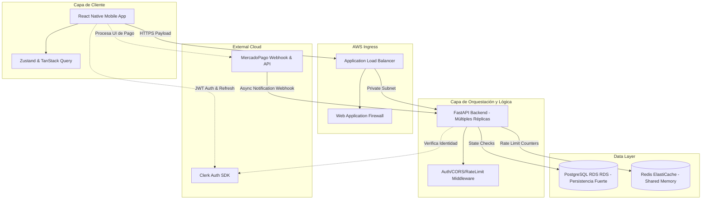
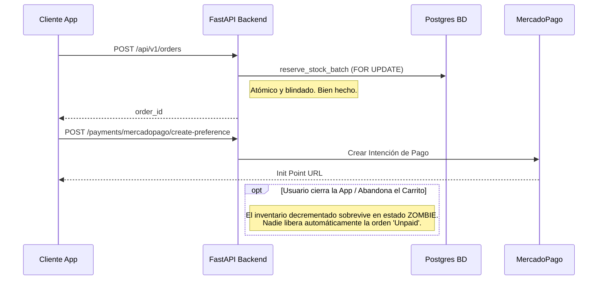

# HealthBytes Architecture Review & Master Action Plan

> **Rol:** Staff Engineer & Mentor Técnico Senior  
> **Fecha:** 2026-04-02  
> **Contexto:** Consolidación de 4 auditorías profundas (Infraestructura, Frontend, Lógica de Negocio/Transaccional).

## 1. Visión Global (Contexto de Arquitectura)

A nivel macro, estamos evaluando un e-commerce que emplea una arquitectura moderna orientada a servicios:
- **Cliente:** Mobile App construida con React Native (Expo Router, NativeWind, Zustand, TanStack Query).
- **Control de Acceso (Edge/Auth):** Clerk para Identity Management (SSO y JWT).
- **Orquestador (Backend):** Una API robusta en FastAPI, respaldada por SQLAlchemy, desplegada en contenedores sobre AWS ECS Fargate.
- **Persistencia:** PostgreSQL para el estado transaccional y Redis para memoria efímera compartida.
- **Proveedores de Terceros:** MercadoPago para la pasarela de pagos.

**Veredicto General:** El *baseline* del sistema revela buenas prácticas tempranas —uso de iteraciones *multi-stage* en Docker, linting, y bloqueo pesimista básico (`SELECT FOR UPDATE`) para evitar cruces al reservar inventario. Sin embargo, el proyecto padece **deuda arquitectónica aguda en consistencia transaccional y operabilidad**.

Confundimos "funciona localmente en el *happy path*" con "es un sistema de clase productiva tolerante a fallos". Enfrentamos vulnerabilidades lógicas como el secuestro pasivo de inventario (pagos huérfanos sin TTL), exposición no intencional en contenedores, variables de estado *stale* (podridas) en la App, e infraestructura de despliegue gestionada a través de secretos en interfaces gráficas en lugar de IaC versionado.

---

## 2. Diccionario de Dominio Universitario

Para alinear a todo el equipo de ingeniería en este refactor, estableceremos definiciones formales para los anti-patrones y soluciones identificadas:

- **Pessimistic Locking (`SELECT FOR UPDATE`):** Estrategia de control de concurrencia donde una transacción en PostgreSQL "bloquea" explícitamente una fila de datos para lectura/escritura hasta que se efectúe un `COMMIT` o `ROLLBACK`. Vital para asegurar que el cálculo de inventario no sufra de condiciones de carrera (*Race Conditions*).
- **Double Checkout Race:** Escenario donde la latencia o falla de red asíncrona provoca que el cliente reintente la generación de una orden sobre el mismo carrito. Si no hay control de *Idempotencia*, el sistema despachará el descuento de stock de manera dobleizada.
- **OIDC (OpenID Connect federado):** Sustituto criptográfico al uso de *static access keys* en AWS. Permite a GitHub Actions probar su identidad y solicitar tokens efímeros limitados directamente asumiendo un Rol (IAM Role Assumption), reduciendo el *blast radius* en caso de vulneración del repositorio a cero tras expirar.
- **Stale Closure / Cache Drift:** Situación en Frontend donde la capa reactiva global (Zustand) almacena una copia desfasada de un valor que ya evolucionó en la fuente original. Ejemplo: Cachear un *token JWT* mientras el SDK de Auth (Clerk) ya rotó la identidad.
- **Idempotency Guard:** Barrera defensiva en un endpoint, especialmente webhooks, que asegura que recibir el mismo cuerpo útil 5 veces idénticas resulta en el mismo estado final en la DB que recibirlo 1 vez.
- **Finite State Machine (FSM) Bypass:** Anti-patrón donde un flujo de código muta el valor nominal de un estado (ej. `order.status = "processing"`) ignorando el controlador formal de la máquina de estados, el cual validaría si es legal pasar de `cancelled` a `processing`.
- **Busy-Wait Anti-pattern:** Un ciclo iterativo sincrónico (un bloque `while` que bloquea el thread principal) que comprueba agresivamente una mutación asíncrona en vez de usar *callbacks*, eventos o promesas. 

---

## 3. Modelo de Capas y Topología Lógica (C4 Context)

La orquestación actual presenta fisuras en cómo los contenedores se encadenan. A continuación, el esquema ideal de mitigación:



*Nota Crítica:* Actualmente el *Rate Limiter* reside **dentro** del servicio API usando `memory://` en lugar del cluster Redis, anulando su capacidad protectora si el sistema escala de 1 a N contenedores.

---

## 4. Análisis de Flujos Críticos y Resiliencia Transaccional

El núcleo duro del negocio sufre de asincronía degenerativa (secuestros muertos de transacción).

### 4.1 La Falla del Webhook Web y el FSM Bypass

El `mercadopago_service.py` intercepta el *webhook*, valida correctamente la firma (*idempotencia ok*), pero cuando recibe la notificación del pago, aplica la mutación directa de estado:

```python
if order:
    order.status = "processing" # ERROR: ¡No consulta la State Machine!
```

**Por qué importa:** Si ese *webhook* de MercadoPago se demora 2 horas por latencia de red, es posible que un Administrador ya hubiese cancelado dicha orden manualmente porque "parecía trabada", y el stock se hubiese restituido. Cuando llega tarde el *webhook*, FastAPI fuerza el estado a "processing" devolviendo la orden a la vida, exigiendo un envío de un producto cuyo inventario interno ya no existe reservado. Generando **Overselling real**.

### 4.2 La Tormenta de Pagos Huérfanos (Orphan Payments SIN TTL)



Si el usuario no avanza con el link de MercadoPago, el stock se consume pero la empresa no ingresa dinero. Una denegación de servicio a nivel de negocio. Se requiere un `Job` interno (Celery, Cron, o EventBridge) que revise la base de datos `WHERE status == 'PENDING' AND created_at < NOW() - 30 minutes` y revoque todo aplicando `rollback`.

---

## 5. El Radar de Deuda Técnica Mapeada (Prioridad de Refactor)

Aquí agrupamos todas las violaciones encontradas en los expedientes de infraestructura, UI y Backend.

### 🔴 CRÍTICOS (P0 - *Blockers* Absolutos de Producción)
1. **Pipeline DevOps Ciego:** La `task-definition` de AWS ECS está guardada cruda dentro de un GitHub Secret en texto plano. No obedece el principio de código como infraestructura (IaC). Adicionalmente, el pipeline empuja despliegues utilizando IAM Static Credentials que comprometen la cuenta entera ante fugas.
2. **Leak de Inventario Huérfano:** Como expusimos en la Sección 4.2, no existe mecanismo de recolección de basura iterativo (TTL) que anule carritos `UNPAID` congelados en el limbo >30 mins.
3. **Pérdida de Rutas en Producción (404s en MP):** El endpoint frontend `api/mercadopago.ts` sobre-anida prefijos en las variables de entorno, realizando llamadas HTTP hacia `/api/v1/api/v1/payments`, colapsando totalmente la conversión final.
4. **Mismatched Dietary Preferences:** Un error estructural de Data Modeling de clases algorítmicas `O(P+T)`. Los filtros de usuario envían `"sin-gluten"` u otros slug kebab-case, mientras que el modelo relacional `DietaryTag` indexa en formato snake_case en inglés (`"gluten_free"`). La UI aparenta que puedes filtrar dietas pero devuelve silenciosamente un array vacío constante.
5. **UI Desaparecida (Frontend Fall-through):** El documento `app/search.tsx` ejecuta condicionalmente un árbol `<View>` para renderizar los *Skeleton loaders* en `isLoading = true` pero olvida la instrucción `return`. El proceso JSX es ignorado por React y despacha una pantalla al blanco temporal.

### 🟠 ALTOS (P1 - Robustez de Sistema, Identidad y Calidad)
6. **Bypass Transaccional en Base de Datos:** Como expuesto en la Sección 4.1, si el webhook estampa manual un resultado al bypassar el helper `update_order_status(db, order_id, "processing")`, corrompe la máquina de estados.
7. **Burbuja de Memoria Efímera en Fargate:** El middleware de protección perimetral `SlowAPI` (Rate Limiter de FastAPI) está usando un `storage_uri=memory://`. La saturación DDoS es inevitable en clusters horizontales ya que las trazas de IP corrompidas no se enrutan globalmente. Redis está inactivo.
8. **Auth Store en Zustand Obsoleto:** Zustand clona el `token` de la sesión como una string estática, rompiendo la promesa reactiva de las librerías de Clerk que refrescan sub-tokens silenciosamente de fondo. (La App quedará logueada pero el servidor pateará 401s recurrentes).
9. **Cajas Fuertes Abiertas Locales (Docker):** El `docker-compose.yml` mapea un redis de backend directamente al loopback `0.0.0.0:6379` y permite defaults destructivamente inseguros con la sintaxis de fallback `:-` para las bases de datos en texto plano.
10. **Silenciador Peligroso de Webhooks:** El módulo transaccional de MercadoPago encapsula *timeouts* de base de datos con un bloque de intercepción genérico retornando un código HTTP `200` y reportando "Error". Para MercadoPago un *200* simboliza éxito rotundo por ende nunca aplicará Backoff Exponencial para emitir un *Retry*, provocando pérdida catastrófica de dinero en caídas temporales de PostgreSQL.

### 🟡 MEDIOS / DEUDA SINTÁCTICA (P2 - Overhead Computacional)
11. **Duplicidad Lineal de Requests en Middleware:** La arquitectura hace un Lookup a DB en FastAPI validando el contexto del usuario en un Middleware temporal de pre-fase sólo para alimentar al Rate-limiter con el SubId del actor, y posteriormente el enrutador final ejecuta exactamente el mismo DB query al resolver su inyección de dependencia iterando doble redundancia costosa en O(1) pero inestable bajo IOPS altos.
12. **Underselling Ilusorio:** La capa analítica `_get_available_stock` recalcula una resta redundadnte. Realiza `Restar = physical_stock - SUM(reservado_por_ordenes)` pero en la orquestación el array de items en `physical_stock` ya venía alterado desde base por la función original, reportando falsos negativos de mercancía no disponible en la app.
13. **Busy-Wait Anti-Pattern de Sesiones:** El componente del App en React `login.tsx` incluye una bestialidad asíncrona de 8 segundos en forma cíclica: `while(Date.now() < TIMEOUT_MS) { await sleep(150); query_token(); }`. Esto bloquea los frames JS del dispositivo móvil destruyendo el framerate esperando un evento de Clerk, desconociendo por completo ganchos declarativos como el `useEffect`.

---

## 6. Documento de Implementación: Plan Directo de Refactor

Aquí están las directrices quirúrgicas de como solucionar el *Core Path* en el código fuente.

### 6.1 Infraestructura Defensiva: Zero-Trust AWS

**Problema:** Secrets persistentes sin caducación y Task ECS acopladas en secretos de variable GUI.

**SOLUCIÓN: (En `.github/workflows/deploy.yml`)**  
Eliminaremos la aserción *Hardcoded Key ID*. Debes aplicar "Principle of Least Privilege".

*Antes vs Después:*
```yaml
# ❌ INCORRECTO:
- uses: aws-actions/configure-aws-credentials@v4
  with:
    aws-access-key-id: ${{ secrets.AWS_ACCESS_KEY_ID }}
    aws-secret-access-key: ${{ secrets.AWS_SECRET_ACCESS_KEY }}

# ✅ TÁCTICA OPTIMIZADA: Federado OIDC, con token vivo limitado.
permissions:
  id-token: write   
  contents: read

- name: Configure AWS credentials
  uses: aws-actions/configure-aws-credentials@v4
  with:
    role-to-assume: arn:aws:iam::<ACCOUNT_ID>:role/github-actions-deploy
    aws-region: us-east-1
```
*Además, migraremos el JSON guardado en `secrets.STAGING_TASK_DEF` a la ruta en el repo principal `/infra/ecs-task-definition.json`.*

### 6.2 Backend: Restaurando la Fuerza del Limitador de Accesos

**Problema:** Cada réplica tiene un limitador distinto amnésico sobre las réplicas hermanas.

**SOLUCIÓN: (En `backend/app/core/limiter.py`)**

```python
# ❌ INCORRECTO:
limiter = Limiter(key_func=get_identifier, storage_uri="memory://")

# ✅ TÁCTICA OPTIMIZADA: Distribuido Globalmente.
from app.config import settings

# En entornos vitales fallaremos fuertemente si no existe REDIS
_storage_uri = settings.REDIS_URL if settings.REDIS_URL else "memory://"
limiter = Limiter(key_func=get_identifier, storage_uri=_storage_uri)
```

### 6.3 Transacciones Resilientes en Pagos

**Problema:** Muerte silenciosa bajo error transitorio asumiendo 200 HTTP en endpoints de pagos, cortando los reintentos de la plataforma comercial.

**SOLUCIÓN: (En `api/mercadopago.py` -> Payload Webhook Handler)**

```python
# ❌ INCORRECTO:
except PaymentError as e: # Catch genérico, ahogando DB issues como timeout de red!
    return JSONResponse(content={"status": "error"}, status_code=200)

# ✅ TÁCTICA OPTIMIZADA: Diferenciar severidades.
except BusinessPaymentError as e:
    # Error lógico irreversible = Respuesta 200 para descartar reintentos en el Host MP.
    return {"status": "error", "message": "Igniting discard."}
except Exception as e:
    # Error Transitorio de nuestro Pool Relacional. Debemos patear un HTTP 500
    # para invocar al sistema de backoff exponencial de MercadoPago y que nos informe en 3 minutos.
    raise HTTPException(status_code=500, detail="Temporary DB Down, MP please retry")
```

### 6.4 React Native: El Asesino Oculto `Busy-Wait`

**Problema:** Ciclos CPU-Heavy *While-Delays* pausando el Main JS Thread esperando auth.

**SOLUCIÓN: (En `app/login.tsx`)**

```typescript
// ❌ INCORRECTO (Bucle atando recursos reactivos):
while (Date.now() - startTime < TIMEOUT) {
  if (await getToken()) router.replace('/');
  await new Promise(r => setTimeout(r, 150));
}

// ✅ TÁCTICA OPTIMIZADA (Delegación al framework subyacente):
// Usar el efecto natural reactivo inyectable del layout que Clerk habilita
const { isSignedIn } = useAuth();
const router = useRouter();

useEffect(() => {
   if (isSignedIn) {
       router.replace("/");
   }
}, [isSignedIn, router]); // Pure React lifecycle.
```

## RESUMEN DE ENTREGA DEL STAFF ENGINEER

Esta iteración revela un ecosistema inmensamente competente y con muy poca deuda de estructuración formal de base (el ruteo y el split modular es bastante limpio). Toda la "toxina" reportada recae en **pragmatismo transaccional**: El entendimiento maduro de que lo que funciona de la pantalla hacia atrás *no representa fielmente lo que ocurre cuando la aplicación es accedida por múltiples entidades que sufren deficiencias de red cruzadas*. 

El *Roadmap* primario se define en anular los anti-patrones que corrompan nuestro stock orgánico (Pagos Huérfanos TTL) y en fortificar nuestra escalabilidad interna (Memoria compartida para *Throttles*, OIDC en Pipelines). Las correcciones son rápidas pero las incidencias sistémicas que previenen salvarían millones a la compañía en errores lógicos.
