# Flujo B2B de Inserción de Productos - HealthBytes

## Descripción
Este diagrama representa el flujo completo de inserción de productos desde un proveedor B2B externo hasta la activación y monitoreo en la plataforma HealthBytes self-hosted.

## Diagrama de Flujo

```mermaid
graph LR
    %% Estilos
    classDef decisionStyle fill:#FFE5B4,stroke:#FF8C00,stroke-width:2px,color:#000
    classDef actionStyle fill:#B4D7FF,stroke:#0066CC,stroke-width:2px,color:#000
    classDef successStyle fill:#90EE90,stroke:#006400,stroke-width:2px,color:#000
    classDef errorStyle fill:#FFB4B4,stroke:#CC0000,stroke-width:2px,color:#000
    classDef noteStyle fill:#F0E68C,stroke:#DAA520,stroke-width:1px,color:#000

    %% === ETAPA 1: IDENTIFICACIÓN DEL PROVEEDOR ===
    Start([Inicio: Búsqueda de Proveedores B2B]):::actionStyle
    Start --> IdentifyProvider[Identificar Proveedor B2B Externo]:::actionStyle
    
    IdentifyProvider --> CheckProvider{¿Proveedor<br/>cumple requisitos<br/>básicos?}:::decisionStyle
    
    CheckProvider -->|No| SearchAlternative[Buscar Proveedor Alternativo]:::actionStyle
    SearchAlternative --> IdentifyProvider
    
    CheckProvider -->|Sí| CollectData[Recopilar Información del Proveedor]:::actionStyle
    
    %% Notas Etapa 1
    Note1[📋 Requisitos: Certificaciones,<br/>historial, capacidad de producción]:::noteStyle
    CheckProvider -.->|Verificar| Note1
    
    %% === ETAPA 2: VALIDACIÓN DE ESPECIFICACIONES ===
    CollectData --> ValidateSpecs[Validar Especificaciones del Producto]:::actionStyle
    
    ValidateSpecs --> CheckQuality{¿Calidad<br/>aceptable?}:::decisionStyle
    CheckQuality -->|No| RejectProvider[Rechazar Proveedor]:::errorStyle
    RejectProvider --> End1([Fin: Proveedor No Aprobado]):::errorStyle
    
    CheckQuality -->|Sí| CheckPrice{¿Precio<br/>competitivo?}:::decisionStyle
    CheckPrice -->|No| NegotiatePrice[Negociar Mejores Condiciones]:::actionStyle
    NegotiatePrice --> CheckPrice
    
    CheckPrice -->|Sí| CheckStock{¿Stock<br/>disponible y<br/>sostenible?}:::decisionStyle
    CheckStock -->|No| EvaluateCapacity[Evaluar Capacidad de Producción]:::actionStyle
    EvaluateCapacity --> CheckStock
    
    %% Notas Etapa 2
    Note2[🔍 Validaciones:<br/>- Ingredientes y alérgenos<br/>- Certificaciones sanitarias<br/>- Análisis nutricional<br/>- Precio vs competencia<br/>- Disponibilidad mínima]:::noteStyle
    ValidateSpecs -.->|Criterios| Note2
    
    %% === ETAPA 3: NEGOCIACIÓN DE CONTRATO ===
    CheckStock -->|Sí| InitiateContract[Iniciar Negociación de Contrato]:::actionStyle
    
    InitiateContract --> SelectChannel{¿Canal de<br/>negociación?}:::decisionStyle
    
    SelectChannel -->|API| APIIntegration[Integración Automática vía API]:::actionStyle
    SelectChannel -->|Email| EmailNegotiation[Negociación Manual por Email]:::actionStyle
    
    APIIntegration --> ValidateAPI{¿API<br/>responde<br/>correctamente?}:::decisionStyle
    ValidateAPI -->|No| EmailNegotiation
    ValidateAPI -->|Sí| GenerateContract[Generar Contrato Automático]:::actionStyle
    
    EmailNegotiation --> ManualReview[Revisión Manual de Términos]:::actionStyle
    ManualReview --> GenerateContract
    
    GenerateContract --> SignContract{¿Contrato<br/>firmado?}:::decisionStyle
    SignContract -->|No| RejectProvider
    
    %% Notas Etapa 3
    Note3[📄 Contrato incluye:<br/>- SLA de entrega<br/>- Políticas de devolución<br/>- Términos de pago<br/>- Exclusividad territorial<br/>- Penalizaciones]:::noteStyle
    SignContract -.->|Términos| Note3
    
    %% === ETAPA 4: INTEGRACIÓN AL CATÁLOGO ===
    SignContract -->|Sí| PrepareIntegration[Preparar Integración Técnica]:::actionStyle
    
    PrepareIntegration --> UpdateDocker[Actualizar Contenedores Docker]:::actionStyle
    UpdateDocker --> BuildImages[Build & Deploy Nuevas Imágenes]:::actionStyle
    
    BuildImages --> CheckBuild{¿Build<br/>exitoso?}:::decisionStyle
    CheckBuild -->|No| RollbackDocker[Rollback Docker]:::errorStyle
    RollbackDocker --> UpdateDocker
    
    CheckBuild -->|Sí| InsertDB[Insertar Productos en Base de Datos]:::actionStyle
    
    InsertDB --> ValidateDB{¿Inserción<br/>correcta?}:::decisionStyle
    ValidateDB -->|No| RollbackDB[Rollback Database]:::errorStyle
    RollbackDB --> InsertDB
    
    ValidateDB -->|Sí| UpdateCatalog[Actualizar Índices y Catálogo]:::actionStyle
    
    %% Notas Etapa 4
    Note4[⚙️ Operaciones técnicas:<br/>- docker-compose up -d<br/>- Migraciones de BD<br/>- Indexación Elasticsearch<br/>- Cache invalidation<br/>- CDN sync]:::noteStyle
    UpdateDocker -.->|Stack| Note4
    
    %% === ETAPA 5: APROBACIÓN Y ACTIVACIÓN ===
    UpdateCatalog --> InternalReview[Revisión Interna de Calidad]:::actionStyle
    
    InternalReview --> TestProduct[Pruebas de Producto en Staging]:::actionStyle
    
    TestProduct --> ApprovalCheck{¿Aprobado<br/>para venta?}:::decisionStyle
    ApprovalCheck -->|No| FixIssues[Corregir Problemas Detectados]:::actionStyle
    FixIssues --> TestProduct
    
    ApprovalCheck -->|Sí| ActivateSales[Activar Producto para Ventas]:::successStyle
    
    ActivateSales --> PublishProduct[Publicar en Catálogo Público]:::successStyle
    
    %% Notas Etapa 5
    Note5[✅ Checklist de aprobación:<br/>- UI/UX correcta<br/>- Información completa<br/>- Precios validados<br/>- Stock sincronizado<br/>- SEO optimizado]:::noteStyle
    ApprovalCheck -.->|Validaciones| Note5
    
    %% === ETAPA 6: MONITOREO ===
    PublishProduct --> SetupMonitoring[Configurar Monitoreo]:::actionStyle
    
    SetupMonitoring --> TraefikSetup[Configurar Traefik Routing]:::actionStyle
    TraefikSetup --> ProxmoxMonitor[Monitoreo en Proxmox VE]:::actionStyle
    
    ProxmoxMonitor --> MetricsCheck{¿Métricas<br/>saludables?}:::decisionStyle
    
    MetricsCheck -->|No| Alert[Generar Alerta]:::errorStyle
    Alert --> Investigation[Investigar Problema]:::actionStyle
    Investigation --> FixProduction[Aplicar Fix en Producción]:::actionStyle
    FixProduction --> MetricsCheck
    
    MetricsCheck -->|Sí| ContinuousMonitor[Monitoreo Continuo 24/7]:::successStyle
    
    %% Notas Etapa 6
    Note6[📊 KPIs monitoreados:<br/>- Latencia de API<br/>- Tasa de conversión<br/>- Errores 4xx/5xx<br/>- Stock real-time<br/>- Satisfacción cliente<br/>- Uptime SLA]:::noteStyle
    ProxmoxMonitor -.->|Dashboards| Note6
    
    ContinuousMonitor --> Success([Fin: Producto Activo y Monitoreado]):::successStyle
    
    %% Flujo de Feedback
    ContinuousMonitor -.->|Datos de<br/>performance| InternalReview
```

## Leyenda de Símbolos

| Símbolo | Tipo | Descripción |
|---------|------|-------------|
| 🟦 Azul | Acción | Paso de proceso o actividad |
| 🟨 Naranja | Decisión | Punto de validación o bifurcación |
| 🟩 Verde | Éxito | Resultado positivo o estado final |
| 🟥 Rojo | Error | Resultado negativo o rollback |
| 🟨 Amarillo claro | Nota | Información adicional o contexto |

## Etapas del Flujo

### Etapa 1: Identificación del Proveedor B2B
- Búsqueda y selección de proveedores externos
- Verificación de requisitos básicos (certificaciones, historial)
- Recopilación de información inicial

### Etapa 2: Validación de Especificaciones
- Validación de calidad del producto
- Análisis de competitividad de precios
- Verificación de disponibilidad de stock
- Evaluación de ingredientes y alérgenos

### Etapa 3: Negociación de Contrato
- Selección de canal (API automática vs email manual)
- Negociación de términos y condiciones
- Generación y firma de contrato
- Definición de SLAs y políticas

### Etapa 4: Integración al Catálogo
- Actualización de contenedores Docker
- Build y deploy de imágenes
- Inserción en base de datos PostgreSQL
- Actualización de índices y catálogo
- Sincronización de cache

### Etapa 5: Aprobación y Activación
- Revisión interna de calidad
- Pruebas en entorno staging
- Validación final de aprobación
- Activación para ventas
- Publicación en catálogo público

### Etapa 6: Monitoreo Continuo
- Configuración de Traefik para routing
- Monitoreo en Proxmox VE
- Tracking de métricas clave (latencia, errores, conversión)
- Sistema de alertas automáticas
- Feedback loop para mejora continua

## Puntos de Decisión Críticos

1. **Calidad del Proveedor**: Rechazo inmediato si no cumple estándares mínimos
2. **Precio Competitivo**: Negociación iterativa hasta alcanzar acuerdo
3. **Stock Sostenible**: Evaluación de capacidad de producción a largo plazo
4. **Build Exitoso**: Rollback automático ante fallas
5. **Aprobación Final**: Testing exhaustivo antes de publicar
6. **Métricas Saludables**: Monitoreo continuo con alertas automáticas

## Tecnologías Involucradas

- **Docker**: Containerización y deployment
- **PostgreSQL**: Base de datos relacional
- **Traefik**: Reverse proxy y load balancer
- **Proxmox VE**: Virtualización y monitoreo de infraestructura
- **FastAPI**: Backend para integraciones API
- **React Native**: Frontend mobile para gestión

## Notas de Implementación

### Automatización Recomendada
- Pipeline CI/CD para etapas 4-6
- Scripts de rollback automático
- Webhooks para notificaciones de estado
- Sincronización de stock en tiempo real

### Consideraciones de Seguridad
- Validación de inputs de proveedores
- Sanitización de datos antes de DB insert
- Audit logs de todas las operaciones
- Encriptación de datos sensibles del contrato

### Escalabilidad
- Queue system para procesamiento asíncrono
- Cache distribuido (Redis)
- CDN para assets de productos
- Rate limiting en APIs de proveedores

---

**Versión**: 1.0  
**Fecha**: Febrero 2026  
**Autor**: HealthBytes Team  
**Última actualización**: 2026-02-02
