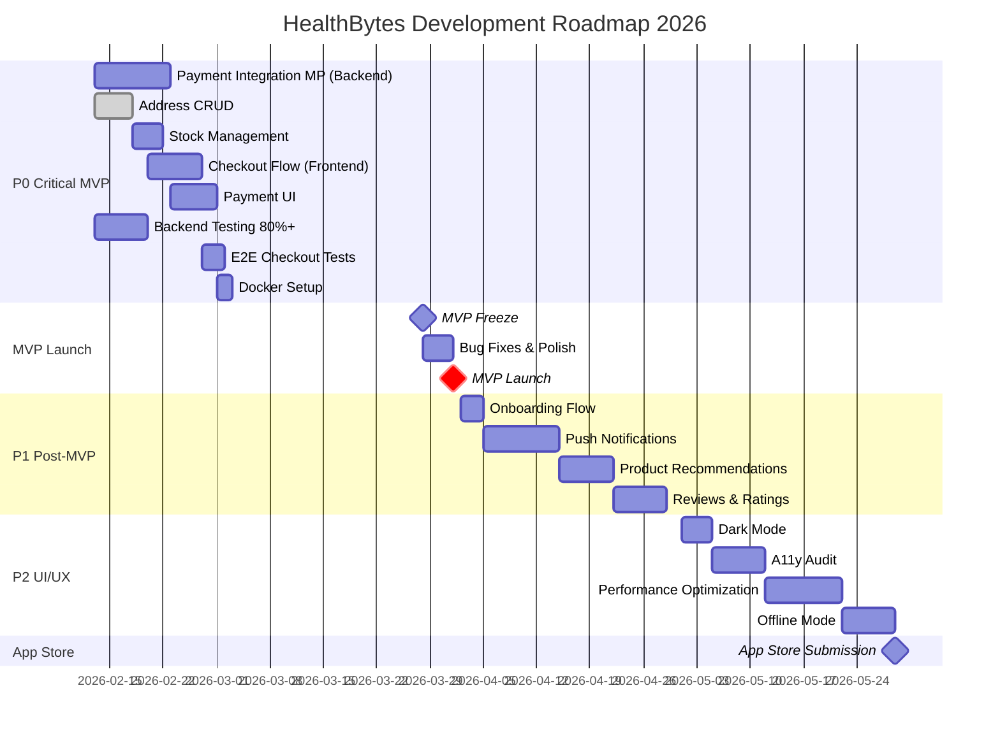
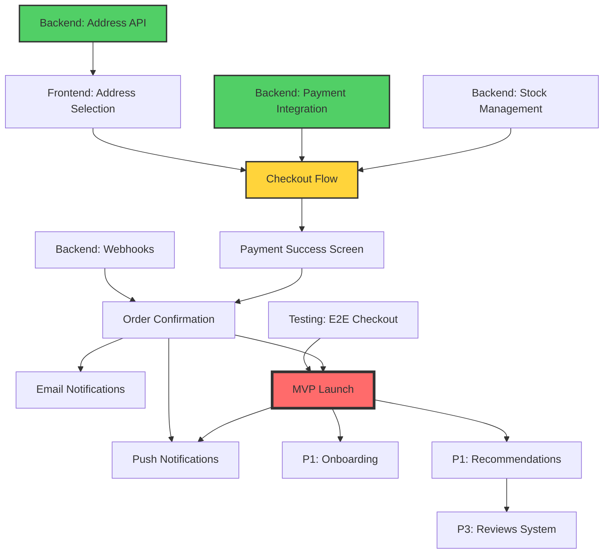
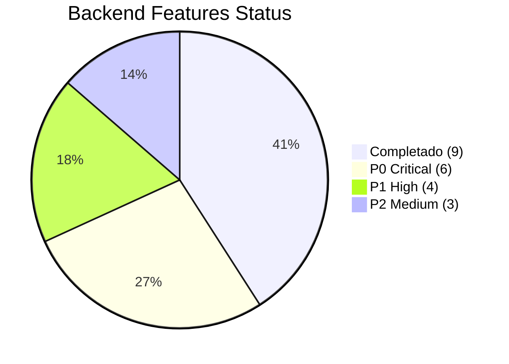
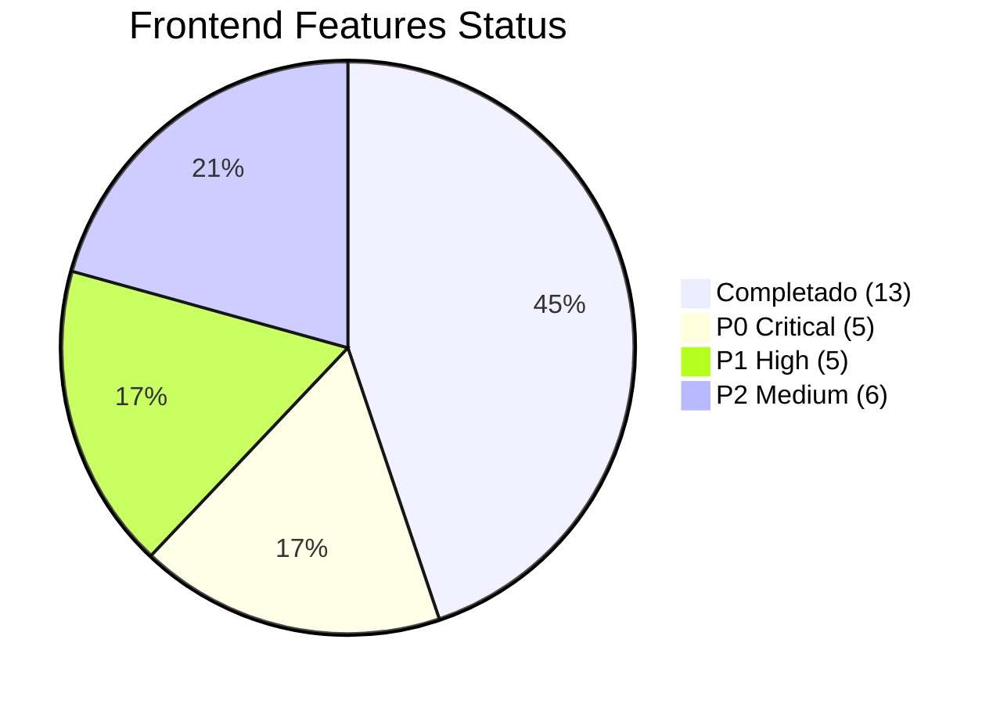
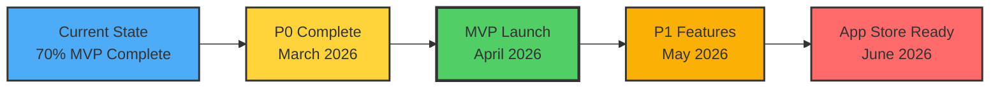
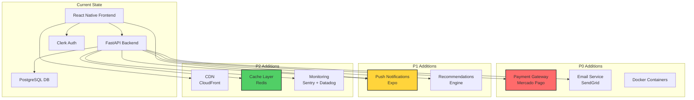
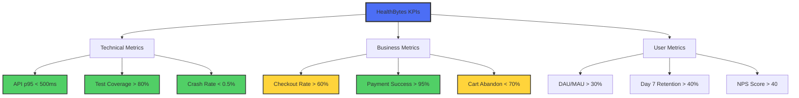

# 🗓️ HealthBytes - Roadmap Visual

> **Diagrama interactivo del roadmap de desarrollo 2026**

## 📅 Timeline General



## 🔄 Dependencias de Features



## 🎯 Prioridades por Área

```mermaid
quadrantChart
    title Feature Prioritization Matrix
    x-axis Low Effort --> High Effort
    y-axis Low Impact --> High Impact
    quadrant-1 Do First (P0)
    quadrant-2 Plan Carefully (P1)
    quadrant-3 Low Priority (P3)
    quadrant-4 Quick Wins (P1)
    
    Payment Integration: [0.8, 0.95]
    Address CRUD: [0.4, 0.85]
    Checkout Flow: [0.7, 0.9]
    Push Notifications: [0.6, 0.75]
    Dark Mode: [0.3, 0.6]
    Onboarding: [0.3, 0.8]
    Reviews System: [0.8, 0.65]
    Recommendations: [0.7, 0.7]
    Filter Persistence: [0.1, 0.5]
    Deep Linking: [0.4, 0.5]
    Offline Mode: [0.7, 0.55]
    A11y Audit: [0.6, 0.7]
```

## 📊 Estado de Implementación





## 🚦 Milestone Progress



## 🏗️ Architecture Evolution



## 🎯 KPIs Dashboard



---

## 📖 Leyenda

| Símbolo | Significado |
|---------|-------------|
| 🔴 P0 | Crítico para MVP - Bloqueador |
| 🟠 P1 | Alta prioridad - Post-MVP |
| 🟡 P2 | Media prioridad - Polish |
| 🟢 P3 | Baja prioridad - Nice to have |
| ⚡ | Quick win (< 2 días) |
| 🚧 | En progreso |
| ✅ | Completado |

---

**Ver detalles completos**: [ROADMAP.md](../ROADMAP.md)
